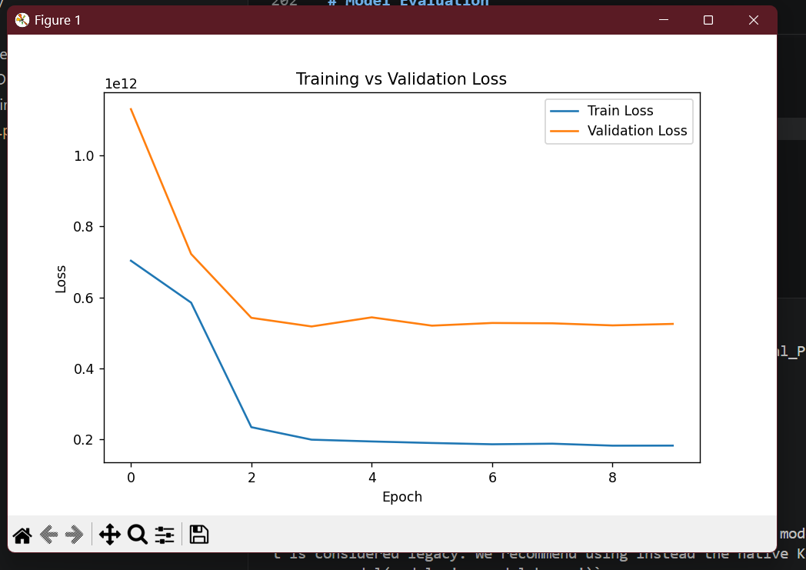

# Multimodal Housing Price Prediction Using Images + Tabular Data

## Project Overview

This project focuses on predicting housing prices using a **Multimodal Machine Learning** approach. The model combines:

* 🖼️ House Images (visual data)
* 📊 Structured Tabular Data (numerical features)

A Convolutional Neural Network (CNN) was used to extract features from house images, while dense neural network layers processed the tabular features. Both feature sets were fused together to build a powerful regression model capable of predicting house prices.

This project demonstrates the practical implementation of:

* Deep Learning
* Computer Vision
* Multimodal Machine Learning
* Feature Fusion
* Regression Modeling


# Objective

The main objective of this project is to:

> Predict housing prices using both house images and structured property information through a multimodal deep learning architecture.

Instead of relying only on tabular data, this project also uses visual information from house images to improve prediction performance.

# Skills Gained

Through this project, the following skills were learned and implemented:

* Multimodal Machine Learning
* Convolutional Neural Networks (CNNs)
* Deep Learning using TensorFlow & Keras
* Image Preprocessing with OpenCV
* Tabular Data Preprocessing
* Feature Fusion Techniques
* Regression Modeling
* Model Evaluation using MAE & RMSE
* Data Normalization
* Train-Test Splitting
* Visualization of Training Performance


# Dataset Used
https://github.com/emanhamed/Houses-dataset?

## Housing Dataset

The project uses a housing dataset containing:

### 📊 Tabular Features

* Bedrooms
* Bathrooms
* Area
* Zipcode
* Price

### 🖼️ Image Data

For every house, multiple images were available:

* Front View
* Bedroom
* Bathroom
* Kitchen

In this implementation, the **front view images** were used for training the CNN model.


# Dataset Structure

```bash
Housing_Multimodal_Project/
│
├── data/
│   ├── Houses Dataset/
│   │   ├── 1_frontal.jpg
│   │   ├── 1_bedroom.jpg
│   │   ├── 1_bathroom.jpg
│   │   ├── 1_kitchen.jpg
│   │   └── ...
│   │
│   └── HousesInfo.txt
│
├── models/
│   └── housing_multimodal_model.keras
│
├── train.py
├── requirements.txt
└── README.md
```


# Technologies & Libraries Used

The following technologies and libraries were used:

| Technology   | Purpose                         |
| ------------ | ------------------------------- |
| Python       | Programming Language            |
| TensorFlow   | Deep Learning Framework         |
| Keras        | Neural Network API              |
| OpenCV       | Image Processing                |
| NumPy        | Numerical Operations            |
| Pandas       | Data Handling                   |
| Scikit-learn | Data Preprocessing & Evaluation |
| Matplotlib   | Visualization                   |

---

# 🖼️ Image Preprocessing

The following preprocessing steps were applied to house images:

* Images were loaded using OpenCV
* Images were resized to **128 × 128**
* Pixel values were normalized between **0 and 1**
* Images were converted into NumPy arrays

Example:

```python
image = cv2.resize(image, (128, 128))
image = image / 255.0
```

---

# Tabular Data Preprocessing

The structured numerical data was preprocessed using:

* Feature Selection
* Data Normalization using MinMaxScaler
* Train-Test Splitting

Features used:

* Bedrooms
* Bathrooms
* Area

Target Variable:

* Price

Example:

```python
scaler = MinMaxScaler()
X_tabular = scaler.fit_transform(X_tabular)
```


# Model Architecture

The project uses a **Multimodal Neural Network** consisting of:

##  1. CNN for Image Features

The CNN extracts visual features from house images.

### CNN Layers Used

* Conv2D
* MaxPooling2D
* Flatten
* Dense Layers


##  2. Dense Neural Network for Tabular Data

The numerical features are processed using fully connected dense layers.


##  3. Feature Fusion

Both image features and tabular features were combined using:

```python
concatenate()
```

This fusion allows the model to learn from both modalities simultaneously.

# Training Process

The model was trained using:

| Parameter          | Value                    |
| ------------------ | ------------------------ |
| Epochs             | 10                       |
| Batch Size         | 8                        |
| Optimizer          | Adam                     |
| Loss Function      | Mean Squared Error (MSE) |
| Evaluation Metrics | MAE, RMSE                |


# Model Evaluation

The model was evaluated using:

## ✅ Mean Absolute Error (MAE)

Measures the average prediction error.

## ✅ Root Mean Squared Error (RMSE)

Measures the overall prediction performance while penalizing larger errors.

---

# 📊 Final Results

## ✅ MAE (Mean Absolute Error)

```bash
488975.3125
```

## ✅ RMSE (Root Mean Squared Error)

```bash
719046.4683
```


# 📉 Training Graphs Obtained

During training, the following graphs were generated:


## 📌 1. Training vs Validation Loss Graph

This graph shows:

* Reduction in training loss
* Reduction in validation loss
* Learning behavior of the model

Observation:

* Training loss decreased significantly
* Validation loss also improved
* Model successfully learned meaningful patterns

---

## 📌 2. Training vs Validation MAE Graph

This graph shows:

* Improvement in prediction accuracy over epochs
* Reduction in average prediction error

Observation:

* MAE decreased during training
* Model predictions improved gradually


The project generated:

* CNN model summary
* Training logs
* Training vs Validation Loss graph
* Training vs Validation MAE graph
* Final MAE and RMSE results


# 🚀 How to Run the Project

## 1️⃣ Clone Repository

```bash
git clone https://github.com/bushradev01/Multimodal-ML-Housing-Price-PredictionTASK3
```
## 2️⃣ Open Project Folder

```bash
cd Housing_Multimodal_Project
```

## 3️⃣ Create Virtual Environment

```bash
python -m venv .venv
```
## 4️⃣ Activate Virtual Environment

### Windows

```bash
.venv\Scripts\activate
```

## 5️⃣ Install Dependencies

```bash
pip install -r requirements.txt
```

## 6️⃣ Run Training Script

```bash
python train.py
```


# 📌 Output After Running

The model will:

* Load images
* Preprocess data
* Train CNN + tabular model
* Combine features
* Predict house prices
* Display MAE & RMSE
* Generate training graphs
* Save trained model

---

# 💾 Saved Model

The trained model is saved as:

```bash
models/housing_multimodal_model.h5
```

---

# 📚 Key Concepts Implemented

This project demonstrates:

* Multimodal Learning
* CNN Feature Extraction
* Deep Learning Regression
* Image + Tabular Feature Fusion
* TensorFlow Functional API
* Computer Vision
* Data Preprocessing
* Model Evaluation

# 🔮 Future Improvements

The project can be improved further by:

* Using all house images instead of only frontal images
* Increasing dataset size
* Using Transfer Learning models like ResNet or MobileNet
* Hyperparameter tuning
* Increasing epochs
* Adding more tabular features
* Deploying model using Streamlit or Flask


# Conclusion

This project successfully implemented a multimodal deep learning pipeline for housing price prediction using both visual and structured data.

The CNN extracted meaningful visual features from house images, while dense neural network layers processed numerical features. Both modalities were fused together to improve prediction performance.

The project provided hands-on experience in:

* Deep Learning
* CNNs
* Regression Modeling
* Feature Fusion
* Multimodal AI Systems

and demonstrated how combining multiple data sources can improve machine learning applications.

